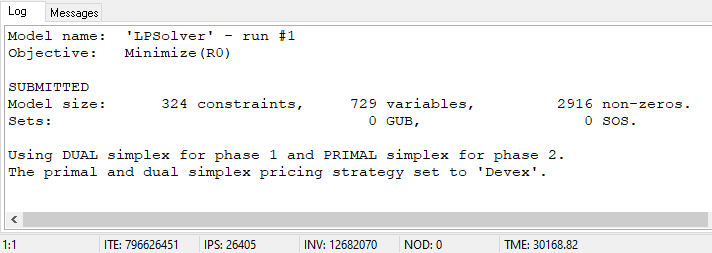

# Introduktion
## Uppgift
Inlämningsuppgiften går ut på att hitta ett verkligt problem som kan lösas med metoderna presenterad i kursen. Problemet kan utgå från en problemställning från en annan kurs eller ett problem som uppstår i vardagen/samhället. Systemet som studeranden bestämmer sig för kan vara ett ekonomiskt eller tekniskt system som skall optimeras. Vikt sätts vid att problemet är relevant och kan lösas med en känd metod. Data använt för de beräkningar som görs skall vara riktiga data eller ifall det är svårt att få tag i riktiga data så kan data estimeras, dock så att det är rimliga siffror. Man kan också göra ett teoretiskt arbete av typen ”ett script som tar ett godtyckligt travelling salesman problem och löser det med linjär programmering, med vilket man testar hur stora tsp problem som kan lösas med lp-solve”. Detta är bara ett exempel och man kan med fördel konsultera föreläsaren gällande ämne.

Inlämningsuppgiftens rapport skall vara minst 6 sidor lång. Den skall innehålla en del som beskriver problem-formuleringen (i text form samt någon typ av flow-chart) samt problemets relevans samt sammanhang. Det skall finnas en del som beskriver problemet matematiskt samt data för det, och en del som beskriver lösningsmetoden samt lösningen (även illustrerad grafiskt) för det data som använts.
Studeranden skall också skriva en sammanfattning om hur metoderna funkade och nyttan med dem i lösandet av det specifika problemet. Man får fritt använda illustration/grafer får att få fram viktiga poänger.

Arbetet presenterar under lektion den 10.12.2020. Håll en 10 minuters presentation (med hjälp av pptx eller dylika program) om ert problem och er lösning. OBS PRESENTATIONEN BEDÖMS OCH PÅVERKAR SLUTPOÄNGEN AV GW!!

## Problemformulering
Vi har valt att söka sätt att lösa det logiska spelet sudoku med olika optimerings metoder. Vi vill skriva optimeringarna i Python och sedermera jämföra de olika metoderna i lösningsförmåga, hastighet och om möjligt komplexitet.

Vi väljer Python eftersom det är något vi arbetat med mycket tidigare och är bekanta med, samt att tiden är kort för projektet och alternativ som R därmed uteslöts eftersom det inte är bekant för oss.

Linjär och pmx är direkta metoder från kursen vi kommer nyttja men även en form av rekursiv (så kallad bakåtspårning/backtracking) samt verktyget PuLP i Python, vårt valda programmeringsspråk.

### Sudoku definiering
Sudoku är ett numeriskt pussel som består av ett rutnät på 81 rutor som ska fyllas med siffrorna 1 till 9 utan att samma siffra får finnas i samma rad, kolumn eller låda, en låda består av de 9 3x3 rutnät som kan bildas inom sudokuns area, denna begränsning kallas även latinsk kvadrat.

Ett sudokuspel ska helst ha endast en lösning för att anses som bra eller äkta och fyllas med minst 17 siffror från början. Antalet förifyllda siffror avgör oftast svårighetsgraden för sudokupusslet. För närvarande kategoriseras oftast sudokun i fyra kategorier, lätta, mellansvåra, expert/svåra och djävulska (devilish).

Vi kommer välja sudokun i varierande svårighetsgrad med bias för första lämpliga alternativ som uppstår genom sökning på internet med Googles sökmotor, vilket leder oss till < https://sudoku.com/ > . Sudokuna ska upplevas ha en sporadisk variation av slumpmässiga tal mellan 1 – 9 utplacerade på ett sådant sett att de inte anses manipulativa mot maskinkod, t.ex. ska de inte ha hela första raden eller kolumnen fyllda med resten av raderna tomma.

# Lösningar
I följande kapitel kommer vi presentera våra olika metoder för att lösa sudoku.

**notis:**
https://en.wikipedia.org/wiki/Sudoku_solving_algorithms

## Linjär programmering i lp_solve
asdasdasd

lp_solve much good!
Totally can solve sudoku04 (expert)

## Linjär programmering i Python med PuLP
Asdasdasd
## Backtracking i Python
Backtracking är en algoritm där man återgår till föregående steg eller lösning så snart man kan fastställa att den nuvarande lösning inte kan bli en komplett lösning. Vi kommer att använda denna princip för backtracking för att implementera följande algoritm.

Algoritmens uppgift är att leta efter tomma rutor i sudokun och sedan försöka placera 1–9 i rutan. När algoritmen har valt ut en ruta och placerat en siffra i den så kontrolleras det att siffran inte redan finns i y eller x axeln och inte i ett 3x3 rutnät. Ifall siffran inte är giltig går den tillbaka och försöker med nästa siffra 1-9. Ifall sifforna inte passar går den vidare till nästa ruta. 

Detta upprepas för varje ruta tills det inte finns nå tomma rutor kvar. När det inte finns någon tom ruta kvar så har vi vår lösning.

Algoritmen klarar av att lösa alla sudokun förutom easy sudoku 01.

### Easy sudoku 02

### Hard sudoku 04

## Genetisk algorithm i Python
Asdasd
# Jämnförelser
## Lösningsförmåga
Asdasdasd
## Hastighet
Asdasd
## Komplexitet
Asdasd
## Reflektioner
asdasdasdasd

 
# Källor

*arcada skriv guide iirc sätt att skriva källor*

Wikipedia, senast redigerad 2020, Sudoku, https://sv.wikipedia.org/, sedd 06 dec 2021, < https://sv.wikipedia.org/wiki/Sudoku> 

Norvig, Peter, 2011, Solving Every Sudoku Puzzle, https://norvig.com/ , sedd 04 dec 2021, < https://norvig.com/sudoku.html >

Easybrain, senast redigerad 2021, https://easybrain.com/, sedd 04 dec 2021, < https://sudoku.com/ > 
