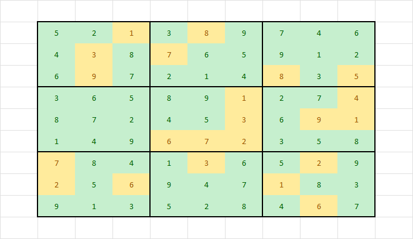

## Linjär programmering i Python med PuLP
PuLP är ett program som kan läsa mps eller lp filer och kalla på olika linjära programmeringsmodeller för att lösa linjära problem. Programmet skiljer sig mestadels i syntaxen från lpsolve och inte i varken uppbyggnaden av problemet eller defineringen av begränsningarna. Det faktum att den har en annan logik i sitt val av lösare däremot påverkar resultaten, som vi förstår det har PuLP dessutom tillgång till ett breddare sortiment av modeller för lösningar.

Vi provar samma easy-sudoku 02 från tidigare och ser resultatet (resultatet är trunkerat samt rader innehållande hur många variabler som lästs och vilka filsystems vägar som använts är borttagna):

    GLPSOL--GLPK LP/MIP Solver 5.0                                              [[4 8 3 9 2 1 6 5 7]  
    Objective value =   0.000000000e+00                                          [9 6 7 3 4 5 8 2 1]
    INTEGER OPTIMAL SOLUTION FOUND BY MIP PREPROCESSOR                           [2 5 1 8 7 6 4 9 3]
    GLPSOL--GLPK LP/MIP Solver 5.0                                               [5 4 8 1 3 2 9 7 6]
    GLPK Integer Optimizer 5.0                                                   [7 2 9 5 6 4 1 3 8]
    PROBLEM HAS NO PRIMAL FEASIBLE SOLUTION                                      [1 3 6 7 9 8 2 4 5]
    Time:  93 ms                                                                 [3 7 2 6 8 9 5 1 4]
                                                                                 [8 1 4 2 5 3 7 6 9]
                                                                                 [6 9 5 4 1 7 3 8 2]]

Lösning ser ut att vara den samma som lpsolve kommit fram till och om vi sedan går vidare och provar det svårare sudokut kommer vi få resultatet:

    GLPSOL--GLPK LP/MIP Solver 5.0
    GLPK Integer Optimizer 5.0                                                  [[5 2 1 3 8 9 7 4 6]
    A: min|aij| =  1.000e+00  max|aij| =  1.000e+00  ratio =  1.000e+00          [4 3 8 7 6 5 9 1 2]
    Problem data seem to be well scaled                                          [6 9 7 2 1 4 8 3 5]
    Constructing initial basis...                                                [3 6 5 8 9 1 2 7 4]
    Size of triangular part is 136                                               [8 7 2 4 5 3 6 9 1]
    Solving LP relaxation...                                                     [1 4 9 6 7 2 3 5 8]
    GLPK Simplex Optimizer 5.0                                                   [7 8 4 1 3 6 5 2 9]
    208 rows, 192 columns, 768 non-zeros                                         [2 5 6 9 4 7 1 8 3]
        0: obj =   0.000000000e+00 inf =   3.000e+01 (27)                        [9 1 3 5 2 8 4 6 7]]
        40: obj =   0.000000000e+00 inf =   0.000e+00 (0)
    OPTIMAL LP SOLUTION FOUND	
    Integer optimization begins...
    Long-step dual simplex will be used
    +    40: mip =     not found yet >=              -inf        (1; 0)
    +    40: >>>>>   0.000000000e+00 >=   0.000000000e+00   0.0% (1; 0)
    +    40: mip =   0.000000000e+00 >=     tree is empty   0.0% (0; 1) INTEGER OPTIMAL SOLUTION FOUND
    GLPSOL--GLPK LP/MIP Solver 5.0
    GLPK Integer Optimizer 5.0
    1 hidden covering inequaliti(es) were detected
    A: min|aij| =  1.000e+00  max|aij| =  1.000e+00  ratio =  1.000e+00
    Problem data seem to be well scaled
    Constructing initial basis...
    Size of triangular part is 137
    Solving LP relaxation...
    GLPK Simplex Optimizer 5.0
    209 rows, 192 columns, 820 non-zeros
        0: obj =   0.000000000e+00 inf =   3.000e+01 (27)
        62: obj =   0.000000000e+00 inf =   3.846e-02 (1)
    LP HAS NO PRIMAL FEASIBLE SOLUTION
    Time: 104 ms

PuLP klara alltså av att lös problem lpsolve inte kunde, däremot för det enkla sudokut var tiden i millisekunder högre med PuLP, vi tittar närmare på den data i kapitlet Jämförelser, Hastighet.

